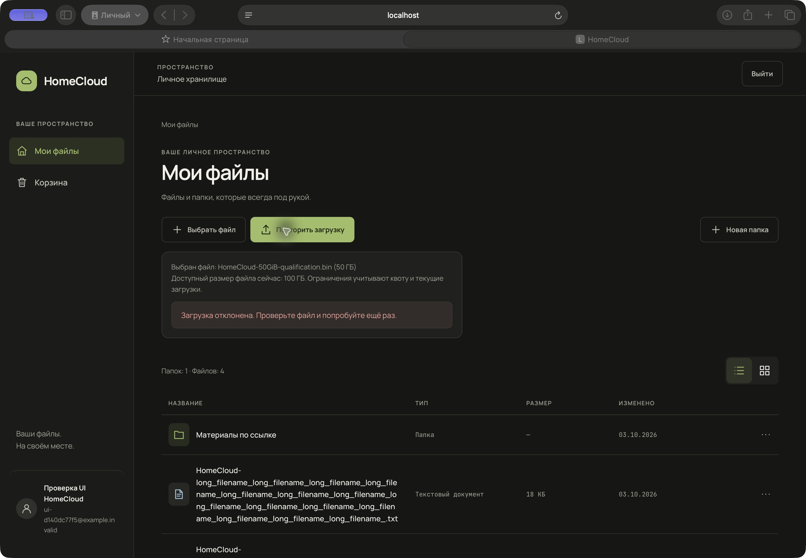

# Полная браузерная проверка 50 ГиБ: отказ при загрузке

Дата: 2026-10-04. Продолжение прежнего qualification checkpoint, без новой Phase.

**DISK_GATE = PASS. 50_GIB_BROWSER_E2E_STATUS = FAIL.** Диск позволил начать проверку, но реальный UI upload завершился HTTP 429 после 98 из 5120 чанков. Полного серверного файла нет; скачивание не запускалось. Продукт не изменён, исправление требует отдельного remediation checkpoint.

## Диск и APFS

| Поле | Результат |
|---|---|
| DISK_SOURCES | df/statvfs, diskutil APFS plist, Foundation NSURL capacity API/NSFileManager, APFS snapshots/tmutil, docker system df, allocation Docker.raw и guest df |
| APFS_CAPACITY | Container disk3: 494 384 795 648 байт; системные/служебные/Data/VM volumes совместно используют container; quota/reserve всех volumes = 0 |
| PHYSICAL_FREE | Foundation basic/NSFileManager/statvfs около 180,220,092,416 байт = 167.84304 GiB; diskutil около 180,24 GB, значения сняты в разные моменты |
| PURGEABLE_RECLAIMABLE | Important − basic = 11,312,955,380 байт = 10.53601 GiB. Это ожидаемая очистка несущественных/кешируемых ресурсов по API, не уже освобождённые блоки и не список конкретных файлов |
| ACTUALLY_WRITABLE_CAPACITY | Для явно запрошенных заменяемых данных Important = 191,533,047,796 байт = 178.37905 GiB; opportunistic = 173,186,668,001 байт = 161.29265 GiB. Это системная оценка доступности, не reservation или гарантия времени reclaim |
| DOCKER_DISK_USAGE | Docker.raw logical 494 384 709 632 байт, до теста allocated 32 247 816 192 байт (09:37:58.845Z); guest /storage ext4 имеет около 397,8 GiB free, но это не дополнительное host capacity. Images 26,26 GB, volumes 2,951 GB, cache 22,18 GB; shared layers нельзя суммировать с raw как независимые копии |
| FILESYSTEM_PLACEMENT | Source /private/tmp, download ~/Downloads и backing Docker.raw на /dev/disk3s5, st_dev 16777233, один APFS container. /storage — existing named volume homecloud-preview_storage_data внутри VM |
| PEAK_FOOTPRINT_CALCULATION | Таблица стадий ниже; sparse worst host high-water 150 GiB + 20 GiB reserve. Требование 170 GiB сохранено |
| DISK_GATE | PASS: Important 178.37905 ≥170 GiB, без ручной очистки. Перед тяжёлыми стадиями необходим fresh capacity budget; проверка прервалась до finalization/download |

Finder около 190 GB согласуется с Important около 191,53 GB. Сравнение 190 decimal GB с 170 binary GiB без перевода единиц некорректно. Сама цифра Finder не использовалась как единственное доказательство.

Apple рекомендует Important capacity для данных, явно запрошенных пользователем; Opportunistic — для прогнозируемой фоновой записи. Локальный SDK NSURL.h дополнительно уточняет включение ожидаемого освобождения кешируемых ресурсов. [Apple: Checking Volume Storage Capacity](https://developer.apple.com/documentation/foundation/checking-volume-storage-capacity). Docker хранит guest storage в одном sparse disk image; logical maximum отличается от physical allocation. [Docker Desktop for Mac](https://docs.docker.com/desktop/troubleshoot-and-support/faqs/macfaqs/).

Data volume snapshots: **0**. Time Machine local snapshots: **0**. System boot snapshot: **1**, com.apple.os.update…, **Purgeable: No**, ограничивает минимальный размер container; его не считали reclaimable и не удаляли. Занятость volumes приведена в evidence.json; в Data учтён и Docker.raw. Никаких snapshots/cache/purgeable/Docker resources вручную не очищали.

### Пик по стадиям

S=50 GiB, A=physical source allocation, C=chunks, F=final, D=download.

| Стадия | Одновременно живущие данные | Sparse A=0 |
|---|---|---:|
| Source | A | 0 |
| Upload окончен | A+C | 50 GiB |
| Finalization до cleanup | A+C+F | 100 GiB |
| После успешного cleanup | A+F | 50 GiB |
| Native download окончен | A+F+D | 100 GiB |

При подтверждённом host reclaim пик sparse около 100 GiB, allocated source около 150 GiB. Если Docker.raw удерживает backing удалённых C, на хосте high-water A+2S+D: sparse до150 GiB, allocated source до200 GiB. Соответственно с20 GiB reserve —170 либо220 GiB. Поэтому170 не снижен: это консервативная sparse граница, а не универсальный бюджет allocated source. Суммировать одновременно живущие C и D для нормального cleanup неправильно; high-water backing объясняет консервативную оценку. Docker.raw и server files не две физические копии. В этой частичной попытке host backing после cleanup вернулся близко к исходному, но это не доказывает reclaim полного50 GiB.

Код: ingress→chunk переименовывается; assembly пишет отдельный final до удаления chunks; native download streams final, без server whole-file temp. Cleanup после commit подавляет ошибки, поэтому отсутствие temp нужно проверять фактически. Основные места: backend/src/uploads/uploads.service.ts:459,719,850,1056; backend/src/files/files.controller.ts:449; frontend/src/files/download.ts:9; frontend/nginx.conf:45.

## Реальная попытка

| Поле | Результат |
|---|---|
| INITIAL_STATE | HEAD52f189589513519f5860105e5462155e88cecd81; main ahead/behind8/0. 496b060,3de3088,8e90dca,7052f62 сохранены как ancestors |
| STACK_IDENTITY | Existing homecloud-preview; backend2e96f568af14, frontend45daae40e2da, PostgreSQLdc54838e53d4, ingress e07d40f4e248; новый stack не создан |
| DISK_PREFLIGHT | PASS по изложенному APFS/Important gate; RAM24 GiB; quota100 GiB, used37021, active reserve0; quota/config не изменялись |
| FIXTURE | Exclusive create+truncate, logical53687091200 байт, allocated0; all-zero sparse; source streaming read всех53687091200 байт, buffer8 MiB, SHA-256 за172,79с |
| BROWSER | Safari27.0, build22625.1.29.11.27; http://localhost:8080/files; обычный системный file picker |
| UPLOAD_CONFIGURATION | Chunk10485760 байт; expected5120; runtime maxFile1 TiB, maxChunks100000; backend maxChunk50 MiB |
| UPLOAD_UI_RESULT | FAIL: кнопка «Загрузить» нажата в Safari; File API напрямую сообщил53687091200, четыре65536-byte extents allZero; UI50 ГБ; после98chunks200 следующийPOST429, UI«Загрузка отклонена…» |
| UPLOAD_ELAPSED | Start09:38:38.747Z, first42909:38:48.436Z, 9.689с до отказа; полный elapsed неприменим |
| UPLOAD_THROUGHPUT | Только частичный committed payload1027604480 байт: 101.146 MiB/s; не throughput полного50 GiB |
| UPLOAD_RESOURCE_PROFILE | Transfer+immediate failure window4 samples/5с, только2 collection-starts внутри строгого transfer interval; backend Docker sampled peak95,44 MiB/CPU91,89%, VmRSS129424 KiB; PG35,50 MiB/CPU1,09%; process-lifetime HWM152408 KiB не назван peak полного upload |
| CHUNK_LATENCY_EARLY | До5% не дошли. 98 early partial samples: mean91.297ms, p5091.016, p95100.447, min80.319, max105.717. Первые/последние10 samples в JSON |
| CHUNK_LATENCY_MIDDLE | NOT_RUN |
| CHUNK_LATENCY_LATE | NOT_RUN |
| LATE_EARLY_RATIO | N/A |
| SCALING_RESULT | NOT_QUALIFIED: остановка на1,914%; отсутствуют middle/late данные. O(N²) по этой попытке не подтверждён и не опровергнут |
| SERVER_METADATA_SIZE | Final files rows0; session.totalSize53687091200, committed uploadedSize1027604480 |
| STORED_SIZE | Final отсутствует; доcleanup98chunk files суммарно1027604480 байт |
| SOURCE_HASH | ab743e145f643a1f6237b7390baf2e6edc71d83997f5bf4ed40d975fb50ba423 |
| STORED_HASH | N/A — final не создан |
| UPLOAD_INTEGRITY | NOT_QUALIFIED |
| DOWNLOAD_UI_RESULT | NOT_RUN — остановка после нового product defect, без API/curl substitution |
| DOWNLOAD_ELAPSED | N/A |
| DOWNLOAD_THROUGHPUT | N/A |
| DOWNLOAD_RESOURCE_PROFILE | N/A |
| BROWSER_MEMORY_EVIDENCE | Sampled Safari+WebKit aggregate peak1040208 KiB≈1015,83 MiB, включает другие tabs/processes; не isolatedJS heap. Полный native50 GiB download не запускался, memory gap остаётся |
| DOWNLOADED_SIZE | N/A — saved copy нет |
| DOWNLOADED_HASH | N/A |
| FINAL_INTEGRITY | NOT_QUALIFIED |
| UI_CONSOLE_NETWORK | UI0% в начале, затем ошибка, false success нет. Две429: chunk и automaticabort; chunk retries0. В qualification requests нет5xx, request loop или логирования credentials. Preflightlogin400 от некорректного ввода инструмента отдельно, затем normal login успешен; console evidence сохранён |
| TEMP_SESSION_STATE | Доcleanup uploading98/5120, chunk rows98, temp98files. После supportedDELETE200 session12aborted retained history, rows0, temp directory отсутствует, active reserve0 |
| CLEANUP | Source удалён; final/download не создавались; UIвыбор очищен, новый Safari tab закрыт. Trash N/A — объект не опубликован. Unrelated data/containers не затронуты; quota37021, config не менялась; stack healthy/ready200, OOMfalse/restarts0 |
| DISK_AFTER_CLEANUP | Basic180,210,896,896 байт=167.83448GiB; Important191,523,852,276 байт=178.37049GiB |
| BACKEND_TESTS | Focused4suites94/94; full61suites757/757 |
| POSTGRES_INTEGRATION | Реальный existingPG, isolatedschemas,0skips; temporaryloopback transport завершён |
| FRONTEND_TESTS | Focused2suites19/19; full18suites176/176 |
| LINT_TYPECHECK_BUILD | Backend/frontend PASS; backend15 существующих warnings/0errors; gitdiffcheckPASS. Две неверные test/typecheck команды исправлены на фактические suite/tsconfig.json; ошибки вызова не выдаются за product defect |
| INDEPENDENT_REVIEW | Disk gate независимыйAPPROVE; финальный qualification review: независимый APPROVE для честного FAIL, UI/File API, причины429, cleanup и gates; Docker.raw baseline исправлен по замеру до transfer |
| DOCS_EVIDENCE | Этот report, evidence.json, FileAPI/UIerror/console/cleanup screenshots; giantlogs/fixtures не коммитятся |
| COMMIT | Один docs/evidence русский commit после review; product изменений нет; push/tag нет |
| FINAL_HEAD | Записывается финальным Git checkpoint после commit |
| GIT_STATUS | Доdocs3 известныхuntracked; их SHA-256 двух разрешённых JSON совпали; forbiddenaudit не читался |
| 50_GIB_BROWSER_E2E_STATUS | **FAIL** |
| REMAINING_GAPS | Retry-After/rate-limit upload compatibility и cleanup reliability; complete5120chunk upload, exactserverstat/hash, native50 GiB download/hash/memory, middle/late scaling ещё не квалифицированы |
| NEXT_STEP | Отдельный remediation checkpoint для upload rate limiting/429 recovery и abort availability; затем полный upload+download50 GiB с нуля; Docker Consolidation не начиналась |

## Фактическая причина отказа

В реально загруженном dist/common/security.config.js `getGlobalRateLimitOptions()` возвращает max100/window60000. Middleware установлен на весь /api/v1. В данном окне: GETuploads/limits304 + POSTuploads/session201 +98POSTchunks200 =100 запросов. СледующийchunkPOST и automaticDELETEsession возвращают429 до controller (поэтому sanitized route=unmatched). Ровно это видно в request evidence и nativeSafari console. Upload transport не ограничивает скорость; frontend isRetryable допускает network/server, но не rate-limit, а неудачный best-effort abort подавляет ошибку. Таким образом один быстрый штатный upload исчерпывает общий лимит и одновременно блокирует собственную очистку. Это product incompatibility между chunk flow и общим rate limit, а не disk/OOM/hash/scaling failure.

После истечения окна использован только штатный DELETE конкретной тестовой сессии f08a34fc-6167-442c-b337-f4e911d30a64. API применялся для diagnostics/cleanup, никогда как замена UI upload/download. Продуктовая защита не отключалась, throttling для получения PASS не добавлялся.

