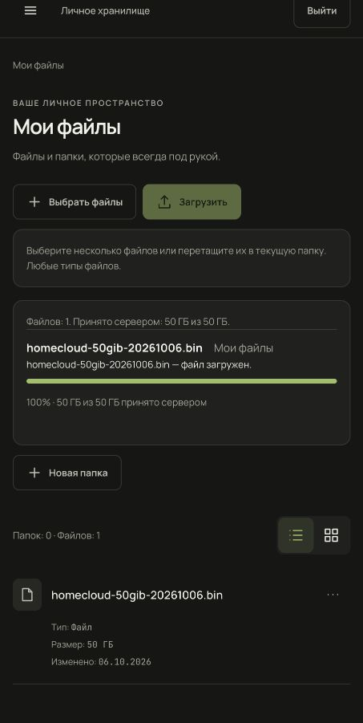
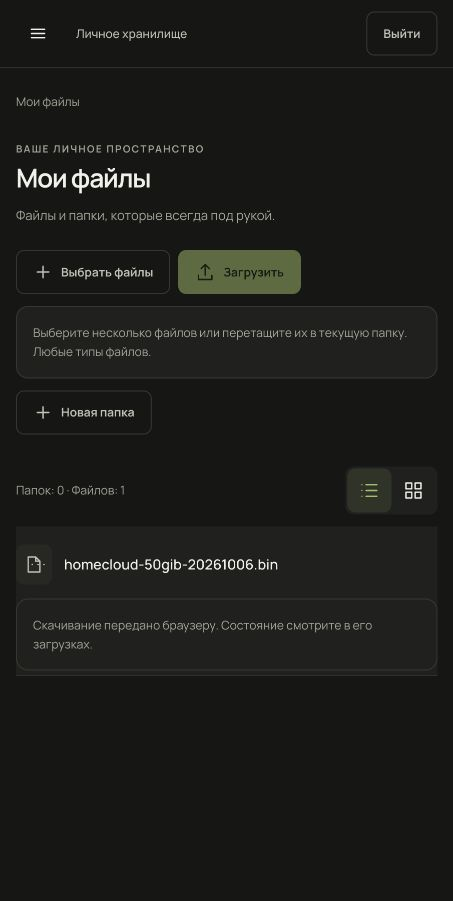

# Полная браузерная проверка 50 ГиБ — 6 октября 2026

**Независимый review: ACCEPT; CRITICAL/HIGH: 0.** Итог `50_GIB_BROWSER_E2E_STATUS = PASS` относится к существующему локальному `homecloud-preview`, IAB/Chromium и HTTP localhost. Код приложения, Compose и принятая конфигурация Nginx не изменены. Новая Phase не создаётся.

| Проверка | Фактический результат |
|---|---|
| Начало | HEAD f57803028253d44c96bce9d17d9669277af0eee9, main ahead/behind19/0. Три исходных untracked сохранены; запретный audit не читался |
| Исходник | 53 687 091 200 байт, выделено 53 695 479 808 байт; os.urandom, не sparse. SHA-256 рассчитан при генерации |
| Три SHA-256 | `dee9a9d8b07f9acbf882d545a70abac0690408ec88d24e94246a7b0b064dab27`: исходник, полное потоковое чтение серверного файла и фактически сохранённой браузером копии совпали |
| Загрузка | Обычный выбор файла и кнопка «Загрузить»; 5120 частей по 10 МиБ, каждый POST 200, complete 200. Единственная основная сессия 71ccec23-a934-46a7-ae83-161e9989efa9 |
| Восстановление | Пауза после 479 частей /4790 МиБ. Точечный 444 вызвал «Требуется действие / Прогресс сохранён». Обновление страницы и повторный выбор исходника продолжили тот же uploadId; хеши 479 принятых частей сохранились |
| Граница отказа | Закрывалось только chunk-соединение этой сессии; полное отключение сети браузера не проверялось. Исходный Nginx восстановлен точно сразу после наблюдения ошибки |
| Задержки частей | По backend completion logs: серверный durationMs, медианы первых 256 /средних 256 /последних 256 запросов:87,746 /92,534 /89,601 мс. Отношение поздних к ранним 1,02114 при заранее заданном пределе 3 |
| Сборка | 181,267658 с при пределе 1800 с. Между первой и последней частью 777,047 с, включая намеренную паузу, отказ и сверку при восстановлении; это не чистое время передачи |
| Скачивание | Меню «Скачать» →менеджер браузера. prepare 200, единственный native GET 200 за 247,610402 с (~206,8 МиБ/с). Процесс ChatGPT записывал .crdownload, затем файл получил исходное имя в Downloads. Все 50 ГиБ прочитаны и сверены по SHA-256 до удаления. API/curl не заменяли передачу |
| Диск | До исходника 177,38 ГиБ; перед скачиванием после удаления исходника и обновления браузера 122,34 ГиБ при требовании 70. Минимальная выборка 23,34 ГиБ, резерв 20. Около 398 ГиБ внутри Docker не считались дополнительным местом на хосте; немедленное освобождение Docker.raw заранее не предполагалось |
| Память | 186 выборок каждые 10 с, ошибок sampling: 0. Максимальный sampled backend VmRSS153,46 МиБ (<1 ГиБ); process lifetime HWM155,59 МиБ. Суммарный RSS семейства ChatGPT/Codex/WebKit4,64 ГиБ включает другие процессы; отдельная вкладка и JS heap не измерены |
| Отмена | Отдельный исходник 2 ГиБ: пауза после 30 МиБ, «Отменить загрузку» →aborted. Строк частей 0, временный каталог отсутствует, резерв квоты освобождён |
| Очистка | Исходник 50 ГиБ, скачанная копия 50 ГиБ, оба опубликованных тестовых объекта и оба коротких исходника удалены. Исходные 5 файлов /37021 байт и fingerprints files/folders/shares/migrations/исходных пользователей совпали. Dev storageUsed0; активных upload-сессий, частей и refresh-сессий 0. Завершённые/aborted записи истории сохранены штатно |
| Конечный стек | Только четыре сервиса homecloud-preview, healthy, OOM=false, restarts=0. HTTP и HTTPS с явной локальной CA — 200, readiness200. Runtime frontend/ingress точно совпадают с source; имена всех Docker volumes неизменны |
| Проверки | Compose config, nginx-t, runtime integrity/cleanup, исходный Git status и хеши двух разрешённых untracked PASS. Полный набор: 825 backend /218 frontend, lint/build не повторены: тот же уже проверенный код; текущие изменения только docs/evidence. git diff --check PASS |

[Критерии до передачи](criteria.json), [метрики](metrics-summary.json), [наблюдения](qualification-result.json), [завершение native GET](native-download-server-completion.json). Полные приватные снимки, хеши частей, наблюдения полного SHA-256, логи, мониторинг и проверочные скрипты находятся под `$HOME/Library/Application Support/HomeCloud/qualification/50gib-browser-20261006/`. Пароли, JWT, env и private keys в Git не копируются.

Ошибки проверочных инструментов зафиксированы отдельно. Поле files.checksum необязательное и не заполняется API; ошибочное требование metadata убрано, полный серверный SHA-256 прочитан повторно и сохранён. Пустой SQL aggregate после удаления частей обработан как null. Ожидание native download event превысило 30 с и сбросило CUA JS; скачивание продолжалось, повторный click не выполнялся. Открытый файл процесса браузера, конечное имя, native GET и полный хеш сохранённой копии подтверждают завершение. Первый исходник 512 МиБ завершился раньше команды Pause; второй 2 ГиБ приостановлен немедленно по свежему UI. Все собственные тестовые файлы очищены.

Два 401 в request counts — ожидаемый отказ refresh после logout. Полный console trace до сброса CUA не сохранился; после сброса 0 записей, преднамеренный обрыв подтверждён снимком интерфейса. Метрики 5120 частей ограничены окном основного upload; короткие тесты отмены не включены в расчёт задержек.

Исторические отчёты FAIL/BLOCKED сохранены. Этот прогон не квалифицирует Safari на 50 ГиБ, public CA/production, macOS atomic certificate rotation, память отдельной вкладки или сохранность старых writable layers, удалённых владельцем до Docker checkpoint. Серверный recreate с полным файлом 50 ГиБ не выполнялся; сохранность canonical data при recreate доказана предыдущим checkpoint. Для обычной разработки автоматический повтор 50 ГиБ не требуется.

[Независимый итоговый review и его границы](independent-review.md).
